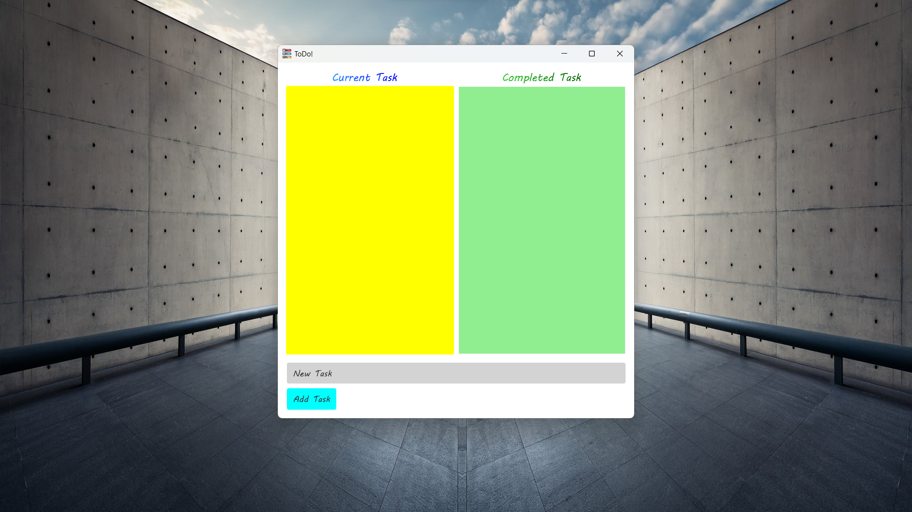
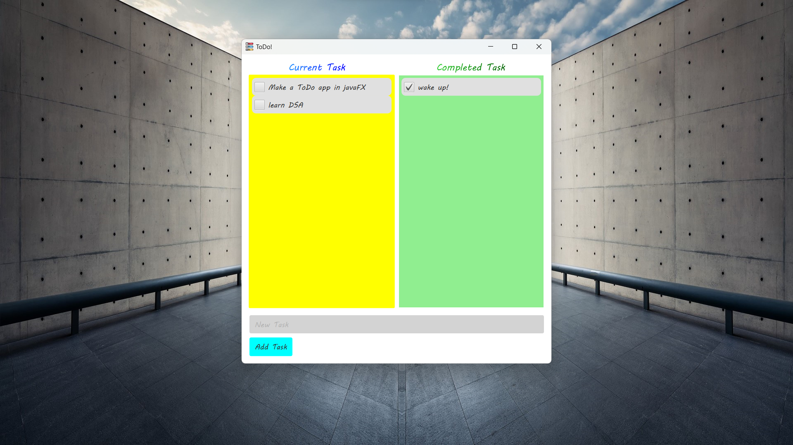

# JavaFX ToDo App

A basic Todo app created by me with beginner level code. Hopefully I will improve it to somewhat fancy. The app lets you
add tasks, mark them as completed, and view both current and completed tasks. Note that the app currently doesn't have
the capability to save tasks to the local machine.

## Features

- Add tasks to the current task list.
- Mark tasks as completed and move them to the completed task list.
- View both current and completed tasks.

## Requirements

- Java 20
- JavaFX library

## Screenshots

## Releases

- **Latest Release:** [Download Here](https://github.com/TeslaC00/ToDo/releases/tag/v1.0)
    - Download the ZIP file from the latest release to get the compiled JavaFX ToDo App.

- *Note: Releases are in early testing stages. Please report any issues you encounter.*

[//]: # (## Known Issues)

[//]: # ()
[//]: # (- Saving tasks to the local machine is not implemented yet.)

## Contributing

If you would like to contribute to this project, feel free to submit pull requests or report issues.

[//]: # (## License)

[//]: # ()
[//]: # (This project is licensed under the [Your License] - see the [LICENSE.md]&#40;LICENSE.md&#41; file for details.)

[//]: # (## Contact)

[//]: # ()
[//]: # (For questions or feedback, you can reach out to [Your Name] via [GitHub]&#40;https://github.com/TeslaC00&#41;.)